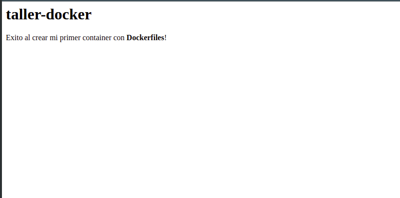

# Taller 3: Creación de imágenes de containers con Dockerfiles  
Bienvenido a este nuevo taller, en esta oportunidad aprenderás a crear tu propia imagen de Docker y subirla a tu repositorio [Docker Hub](https://hub.docker.com/), despues crearás un container, en base a la imagen que creaste anteriormente y al ejecutarse le permitirás que tengan acceso público a través de los puertos. 

Para dicho taller se usara una imagen de Apache en el puerto 80 , el cual saldrá del contendor por el puerto 8888. 

## Requisitos
- Haber realizado el [Taller 2](taller2-acceso-puertos.md)

- Una cuenta en [Docker Hub](https://hub.docker.com/), como recomendacion: recordar bien usuario y contraseña, porque sera de utilidad en los siguientes pasos.

  

## Paso 1: Crear Dockerfile

- [Opcion 1: Crear un archivo Dockerfile y un archivo html](#Opcion1)
- [Opcion 2: Clonar repositorio](#Opcion2)

### Opcion1  

Dentro de una carpeta crear los siguientes archivos

- Dockerfile
- index.html

Contenido del archivo /index.html

```html
<h1>taller-docker</h1>
Exito al crear mi primer container con <b>Dockerfiles</b>!
```

Contenido del archivo /Dockerfile

```dockerfile
FROM ubuntu:18.04
MAINTAINER CloudNativePlusGT
RUN apt-get update
RUN apt-get install -y apache2
RUN rm /var/www/html/*
COPY index.html /var/www/html/
CMD ["/usr/sbin/apache2ctl", "-D", "FOREGROUND"]
EXPOSE 80
```

Donde: 

| Comando                           | Breve descripción                                            |
| --------------------------------- | ------------------------------------------------------------ |
| ```FROM```                        | Indicar que se descargará la imagen de ubuntu con el tag 18.04 |
| ```MAINTAINER```                  | Indica el nombre del creador del container                   |
| ```RUN apt-get update```          | Actualiza los repositorios de la imagen descargada           |
| ```RUN apt-get install apache2``` | Instala apache2 en la imagen                                 |
| ```RUN rm /var/www/html/*  ```    | Borra cualquier contenido dentrol del container en la carpeta /var/www/html |
| ```COPY ```                       | Copia el archivo index.html que se creo hace un momento y colocarlo dentro del container en la ruta /var/www/html |
| ```CMD```                         | Define el comando que se ejecutará dentro del container.     |
| ```EXPOSE ```                     | Define el puerto que expone del container será el 80         |


### Opcion2

Clonar este repositorio y hubicarte dentro de la carpet [taller3-source/](taller3-source) el cual contiene los archivos necesarios para los pasos posteriores.


## Paso 2: Construir imagen y subirla a DockerHub
Es importante tener en cuenta que para poder construir una imagen a partir de un Dockerfile, es necesario ubicarse dentro de la carpeta que tiene tiene el archivo Dockerfile.

1. **Registrar credenciales de dockerHub:** ejecutar el siguiente comando e ingresar el nombre de usuario y contraseña de la cuenta en [Docker Hub](https://hub.docker.com/). 

```
docker login 
```

Tambien en posible autenticarse por medio del siguiente comando:


```
docker login -u <USUARIO> -p <CONTASEÑA>
```

2. **Construir imagen:** Unicamente tenemos que tomar en cuenta que el archivo Dockerfile se encuentre en el entorno donde ejecutemos el siguiente comando. 

```
docker build -t apache .
```

Nota:

La bandera ```-t``` es usada para asignar el nombre del tag que tendra la imagen, en este caso el tag de la imagen sera "apache".

El ```.``` permite informarle a la linea de comandos que el Dockerfile se encuentra en ese entorno.

​		Posible errores:

​			Tag existente: eliminar la imagen que se tiene con un el comando ```docker rmi <ID_IMAGEN>``` 

Para verificar que la imagen fue creada, ingresar el siguiente comando que permite desplegar la metadata de todas las imagenes

``` 
docker images 
```

3. **Taguear la imagen:** Tagueamos la imagen local "apache" con la siguiente estructura

```
docker tag <IMAGE> <USUARIO_DOCKERHUB>/<NOMBRE>
```
​	Nota: ```<NOMBRE>``` es con el que sera visible publicamente en dockerHub

Ejecutar el siguiente comando:

```
docker tag apache <USUARIO_DOCKERHUB>/apache
```

4. **Subir la imagen al repositorio dockerHub**

```
docker push <USUARIO_DOCKERHUB>/apache
```

Listo, nuestra imagen ha sido cargada.

*Extra:*

Si deseas puedes usar el script [build.sh](taller3-source/build.sh) para realizar este paso, es necesario asignarle permisos de ejecución al script.

El siguiente comando es usado en el sistema operativo Linux, el cual determina los permisos al script para ejecutarse. E invoca la ejecucion del script con un parametro que es el nombre de usuario en dockerHub.

```
chmod 777 build.sh
./build <USUARIO_DOCKERHUB>
```

Nota: La cuenta gratuita de Dockerhub, permite subir imagenes de forma automatica. En caso de requerir subir imagenes privadas, es necesario ingresar en [Docker Hub](https://hub.docker.com/). 

## Paso 3: Utiliza la imagen creada

Crearemos un container en base a la imagen creada localmente.

```
docker run -it -d -p 8888:80 --name=apacheNuevo apache
```

Ahora el container se esta ejecuando, el nombre del container es "apacheNuevo". Para verificar que se esta ejecuatando ingresar el siguiente comando:

```
docker ps 
```

## Paso 4: Monitoreo
Para monitorear tu container puedes ejecutar el siguiente comando:

```
docker stats apacheNuevo
```
Presiona Ctrl+C para cancelar el monitoreo del container

## Paso 5: Verificar que container este levantado

Ingresar al navegador web y escribir 

```
http://<IP>:8888
```




Ir a taller 4 : Uso de Docker Compose [Aqui](taller4-docker-compose.md)